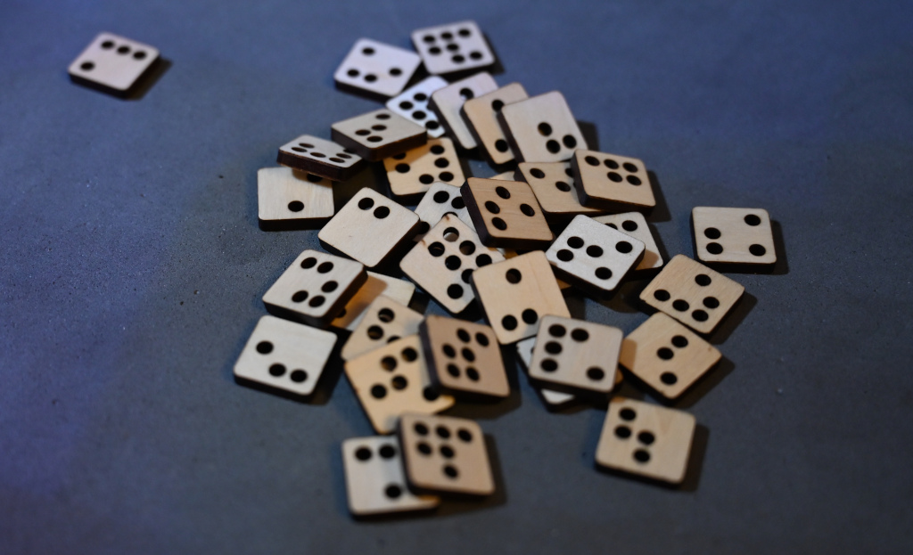
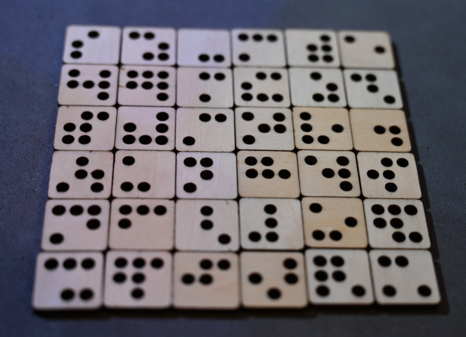

# PasswordRunes36 (Chaos Runes)

Out of 120 patterns that form PasswordRunes60, 48 posess an axial symmetry. The remaining 72 may be arrange in pairs of mirror images.
When mirror images are placed on the opposite side of the same tile the dots may be represented as through holes. This greatly simplifies
laser cutting (no need to etch on both sides or gluing together two separate halves) or 3d printing.

Having holes in place of colors opens up other interesting possibilities, such as mechanical ways of detection.

The 5/8" tiles can be cut on  laser cutter using [the template](PasswordRunes36.svg)

Prototype runes are available from
[Etsy](https://www.etsy.com/listing/940295052/chaos-runes?ref=shop_home_active_1)

## Entropy

When estimating the entropy provided by a subset of full set, I prefere not to include the variation caused by the selection.
The justification for this is that when using a subset, it is quite likely to have the remaining runes located elswhere or even completely lost. This way if the current key is compromised and the user wants to reroll it, the choice of tiles is limited to the ones that are present in the compromised key.

size|shape|bits
--|---|---
6 |2×3| 27
8 |2×4| 39
9 |3×3| 45
10|2×5| 51
12|3×4| 64
15|3×5| 85
18|3×6|106
20|4×5|121
21|3×7|128
24|4×6|151
25|5×5|158
28|4×7|181
30|5×6|197
32|4×8|213
35|5×7|237
36|6×6|246
36|skw|205

Except for the last row, the formula is bits=3·size+log2(size!). The full set of 36 tiles provides 246 bits of entropy, which while less than nominal 256, is still probably more than enough for most applications. 30 tiles (possibly arrange into 5×6 array) are roughly equivalent to 5×5 DiceKeys.

### Skewered runes
The last row in the entropy tables represents a unique opportunity which is specific to this tileset.

It turns out that each tile in the tileset has at least one dot on its side. If dots are implemented as through holes, then it is possible to pass a string or a skewer through the side hole of every tile in the configuration. By convention, the skewered/stringed hole is "on top". This enables a flexible way to store and, possibly, read the configuration. It is importatnt to somehow mark the first rune in the chain, therwise there are 36×2 ways to read a passrwod from a "necklace".

Naturally, the necessity to have each rune in orientation that has a dot on top, limits the possibilities. Since there are 12 runes with 1 side hole, 12 with 2 and 12 with 3, then for each given permutation, number of ways to rotate the individual runes is 1^12·2^12·3^12·2^36 for a total entropy 2·36+12·log2(6)+log2(36!)=205 bits. This is also roughly equivalent to 5×5 DiceKeys.

